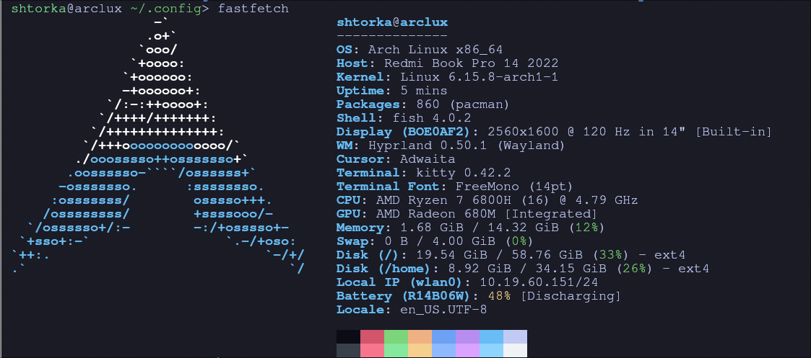

# Dotsfile for hyprland

<p align="center">
  <a href="https://github.com/Shturmill/Traffic-Relay/stargazers">
    
  </a>
  <a href="https://github.com/Shturmill/Traffic-Relay/commits/main">
    
  </a>
</p>

**This repository contains the author's personal configuration files for Hyprland and related applications, along with an automated installation script.**

## Author`s system



for fast installing you can run

```
git clone https://github.com/Shturmill/dotfiles
cd dotfiles
chmod +x install.sh
./install.sh
```

## Key Bindings

There you can shortcuts for apps i use

| Shortcut | Action |
|------------|----------|
| `Super + Q` | Open terminal (Kitty) |
| `Super + C` | Close selected window |
| `Super + E` | Open file manager (Thunar) |
| `Super + R` | Open Wofi |
| `Super + B` | Open Firefox |
| `Super + T` | Open Telegram |
| `Super + Shift+ S` | Take screenshot to clipboard |

**Note:** all orientation function the same as default hyprland config
